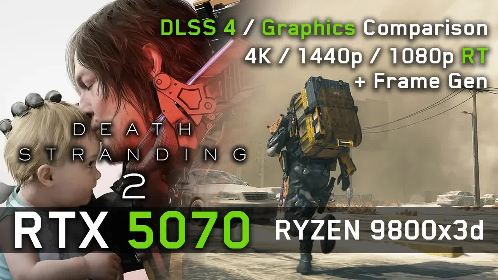

# RTX-5070-in-Death-Stranding-2-4K-⧸-1440p-⧸-1080p-RT,-DLSS-4.5-&-Frame-Gen-+-ALL-Graphics-TESTED!

  <picture>
    
  </picture>

 

---

## Video Information

| Property | Value |
|----------|-------|
| **Video Name** | `RTX-5070-in-Death-Stranding-2-4K-⧸-1440p-⧸-1080p-RT,-DLSS-4.5-&-Frame-Gen-+-ALL-Graphics-TESTED!` |
| **Original Link** | [YouTube Video](https://www.youtube.com/watch?v=069hBjcjWQc) |
| **Total Size** | **10 parts** - **448.80 MB** |
| **Quality** | **720** |
| **Status** | **Complete (100%)** |
| **Password Protected** | **NO** |

---

## Download Links

> ⬇️ Download **all parts**, then open `RTX-5070-in-Death-Stranding-2-4K-⧸-1440p-⧸-1080p-RT,-DLSS-4.5-&-Frame-Gen-+-ALL-Graphics-TESTED!.zip` — the other parts are found automatically.

| # | File | Link |
|---|------|------|
| 1 | `RTX-5070-in-Death-Stranding-2-4K-⧸-1440p-⧸-1080p-RT,-DLSS-4.5-&-Frame-Gen-+-ALL-Graphics-TESTED!.z01` | [Download](https://raw.githubusercontent.com/rezasobhi011/Ourtube/main/videos/RTX-5070-in-Death-Stranding-2-4K-%E2%A7%B8-1440p-%E2%A7%B8-1080p-RT%2C-DLSS-4.5-%26-Frame-Gen-%2B-ALL-Graphics-TESTED%21/RTX-5070-in-Death-Stranding-2-4K-%E2%A7%B8-1440p-%E2%A7%B8-1080p-RT%2C-DLSS-4.5-%26-Frame-Gen-%2B-ALL-Graphics-TESTED%21.z01) |
| 2 | `RTX-5070-in-Death-Stranding-2-4K-⧸-1440p-⧸-1080p-RT,-DLSS-4.5-&-Frame-Gen-+-ALL-Graphics-TESTED!.z02` | [Download](https://raw.githubusercontent.com/rezasobhi011/Ourtube/main/videos/RTX-5070-in-Death-Stranding-2-4K-%E2%A7%B8-1440p-%E2%A7%B8-1080p-RT%2C-DLSS-4.5-%26-Frame-Gen-%2B-ALL-Graphics-TESTED%21/RTX-5070-in-Death-Stranding-2-4K-%E2%A7%B8-1440p-%E2%A7%B8-1080p-RT%2C-DLSS-4.5-%26-Frame-Gen-%2B-ALL-Graphics-TESTED%21.z02) |
| 3 | `RTX-5070-in-Death-Stranding-2-4K-⧸-1440p-⧸-1080p-RT,-DLSS-4.5-&-Frame-Gen-+-ALL-Graphics-TESTED!.z03` | [Download](https://raw.githubusercontent.com/rezasobhi011/Ourtube/main/videos/RTX-5070-in-Death-Stranding-2-4K-%E2%A7%B8-1440p-%E2%A7%B8-1080p-RT%2C-DLSS-4.5-%26-Frame-Gen-%2B-ALL-Graphics-TESTED%21/RTX-5070-in-Death-Stranding-2-4K-%E2%A7%B8-1440p-%E2%A7%B8-1080p-RT%2C-DLSS-4.5-%26-Frame-Gen-%2B-ALL-Graphics-TESTED%21.z03) |
| 4 | `RTX-5070-in-Death-Stranding-2-4K-⧸-1440p-⧸-1080p-RT,-DLSS-4.5-&-Frame-Gen-+-ALL-Graphics-TESTED!.z04` | [Download](https://raw.githubusercontent.com/rezasobhi011/Ourtube/main/videos/RTX-5070-in-Death-Stranding-2-4K-%E2%A7%B8-1440p-%E2%A7%B8-1080p-RT%2C-DLSS-4.5-%26-Frame-Gen-%2B-ALL-Graphics-TESTED%21/RTX-5070-in-Death-Stranding-2-4K-%E2%A7%B8-1440p-%E2%A7%B8-1080p-RT%2C-DLSS-4.5-%26-Frame-Gen-%2B-ALL-Graphics-TESTED%21.z04) |
| 5 | `RTX-5070-in-Death-Stranding-2-4K-⧸-1440p-⧸-1080p-RT,-DLSS-4.5-&-Frame-Gen-+-ALL-Graphics-TESTED!.z05` | [Download](https://raw.githubusercontent.com/rezasobhi011/Ourtube/main/videos/RTX-5070-in-Death-Stranding-2-4K-%E2%A7%B8-1440p-%E2%A7%B8-1080p-RT%2C-DLSS-4.5-%26-Frame-Gen-%2B-ALL-Graphics-TESTED%21/RTX-5070-in-Death-Stranding-2-4K-%E2%A7%B8-1440p-%E2%A7%B8-1080p-RT%2C-DLSS-4.5-%26-Frame-Gen-%2B-ALL-Graphics-TESTED%21.z05) |
| 6 | `RTX-5070-in-Death-Stranding-2-4K-⧸-1440p-⧸-1080p-RT,-DLSS-4.5-&-Frame-Gen-+-ALL-Graphics-TESTED!.z06` | [Download](https://raw.githubusercontent.com/rezasobhi011/Ourtube/main/videos/RTX-5070-in-Death-Stranding-2-4K-%E2%A7%B8-1440p-%E2%A7%B8-1080p-RT%2C-DLSS-4.5-%26-Frame-Gen-%2B-ALL-Graphics-TESTED%21/RTX-5070-in-Death-Stranding-2-4K-%E2%A7%B8-1440p-%E2%A7%B8-1080p-RT%2C-DLSS-4.5-%26-Frame-Gen-%2B-ALL-Graphics-TESTED%21.z06) |
| 7 | `RTX-5070-in-Death-Stranding-2-4K-⧸-1440p-⧸-1080p-RT,-DLSS-4.5-&-Frame-Gen-+-ALL-Graphics-TESTED!.z07` | [Download](https://raw.githubusercontent.com/rezasobhi011/Ourtube/main/videos/RTX-5070-in-Death-Stranding-2-4K-%E2%A7%B8-1440p-%E2%A7%B8-1080p-RT%2C-DLSS-4.5-%26-Frame-Gen-%2B-ALL-Graphics-TESTED%21/RTX-5070-in-Death-Stranding-2-4K-%E2%A7%B8-1440p-%E2%A7%B8-1080p-RT%2C-DLSS-4.5-%26-Frame-Gen-%2B-ALL-Graphics-TESTED%21.z07) |
| 8 | `RTX-5070-in-Death-Stranding-2-4K-⧸-1440p-⧸-1080p-RT,-DLSS-4.5-&-Frame-Gen-+-ALL-Graphics-TESTED!.z08` | [Download](https://raw.githubusercontent.com/rezasobhi011/Ourtube/main/videos/RTX-5070-in-Death-Stranding-2-4K-%E2%A7%B8-1440p-%E2%A7%B8-1080p-RT%2C-DLSS-4.5-%26-Frame-Gen-%2B-ALL-Graphics-TESTED%21/RTX-5070-in-Death-Stranding-2-4K-%E2%A7%B8-1440p-%E2%A7%B8-1080p-RT%2C-DLSS-4.5-%26-Frame-Gen-%2B-ALL-Graphics-TESTED%21.z08) |
| 9 | `RTX-5070-in-Death-Stranding-2-4K-⧸-1440p-⧸-1080p-RT,-DLSS-4.5-&-Frame-Gen-+-ALL-Graphics-TESTED!.z09` | [Download](https://raw.githubusercontent.com/rezasobhi011/Ourtube/main/videos/RTX-5070-in-Death-Stranding-2-4K-%E2%A7%B8-1440p-%E2%A7%B8-1080p-RT%2C-DLSS-4.5-%26-Frame-Gen-%2B-ALL-Graphics-TESTED%21/RTX-5070-in-Death-Stranding-2-4K-%E2%A7%B8-1440p-%E2%A7%B8-1080p-RT%2C-DLSS-4.5-%26-Frame-Gen-%2B-ALL-Graphics-TESTED%21.z09) |
| 10 | `RTX-5070-in-Death-Stranding-2-4K-⧸-1440p-⧸-1080p-RT,-DLSS-4.5-&-Frame-Gen-+-ALL-Graphics-TESTED!.zip` | [Download](https://raw.githubusercontent.com/rezasobhi011/Ourtube/main/videos/RTX-5070-in-Death-Stranding-2-4K-%E2%A7%B8-1440p-%E2%A7%B8-1080p-RT%2C-DLSS-4.5-%26-Frame-Gen-%2B-ALL-Graphics-TESTED%21/RTX-5070-in-Death-Stranding-2-4K-%E2%A7%B8-1440p-%E2%A7%B8-1080p-RT%2C-DLSS-4.5-%26-Frame-Gen-%2B-ALL-Graphics-TESTED%21.zip) |

---

## How to Extract

Download all parts into the **same folder**, then:

| OS | Steps |
|----|-------|
| **Windows** | Double-click `RTX-5070-in-Death-Stranding-2-4K-⧸-1440p-⧸-1080p-RT,-DLSS-4.5-&-Frame-Gen-+-ALL-Graphics-TESTED!.zip` — opens in Explorer, WinRAR, or 7-Zip automatically |
| **Mac** | Double-click `RTX-5070-in-Death-Stranding-2-4K-⧸-1440p-⧸-1080p-RT,-DLSS-4.5-&-Frame-Gen-+-ALL-Graphics-TESTED!.zip` — extracts with Archive Utility or The Unarchiver |
| **Linux** | `unzip RTX-5070-in-Death-Stranding-2-4K-⧸-1440p-⧸-1080p-RT,-DLSS-4.5-&-Frame-Gen-+-ALL-Graphics-TESTED!.zip` or right-click → Extract Here (Ark/File Manager) |
| **Android** | Tap `RTX-5070-in-Death-Stranding-2-4K-⧸-1440p-⧸-1080p-RT,-DLSS-4.5-&-Frame-Gen-+-ALL-Graphics-TESTED!.zip` in your file manager — or use [ZArchiver](https://play.google.com/store/apps/details?id=ru.zdevs.zarchiver) |

---

*This tool created by [avasam.ir](https://avasam.ir)*
